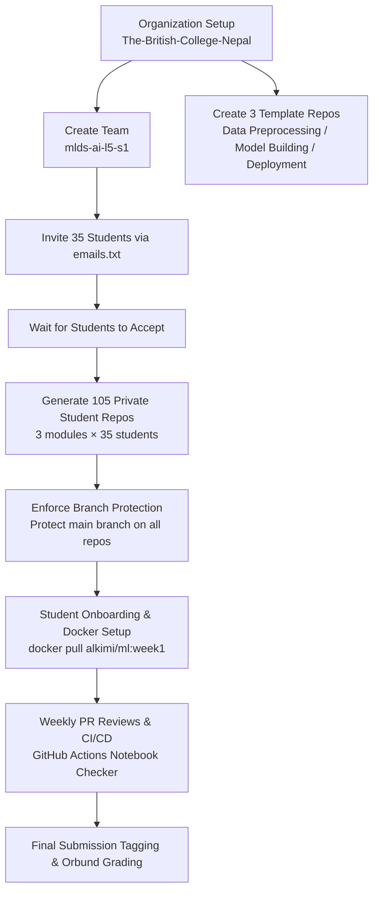

# MLDS-AI Course - Complete Setup Guide for Teachers

**Institution:** The British College Nepal  
**Awarding Body:** UWE Bristol  
**Course / Module:** UFCFAS-15-2 · Machine Learning / MLDS - AI (BSc AI Level 5 Semester 1)  
**Academic Year:** 2026–27  
**Cohort Size:** 35 Students + 1 Instructor  
**Instructor:** Sudan Pudasaini (`sudpudasaini@thebritishcollege.net.np` · GitHub: `Sudan23` · Docker Hub: `alkimi`)  
**Organization:** [`The-British-College-Nepal`](https://github.com/The-British-College-Nepal)  
**Created:** October 9, 2026  

---

## Executive Summary & Architecture

This guide details the complete end-to-end administration and deployment workflow for managing student repositories, continuous integration, Docker environments, and grading for the **MLDS-AI / Machine Learning** cohort.



### Key Milestones:
* ✅ **GitHub Organization:** `The-British-College-Nepal`
* ✅ **Class Cohort Team:** `mlds-ai-l5-s1`
* ✅ **3 Course Modules:** Data Preprocessing, Model Building, and Deployment
* ✅ **105 Private Repositories:** 35 students × 3 modules (Strictly private; only the student and instructors have access)
* ✅ **Docker Standard:** `alkimi/ml:week1` (Python 3.12, JupyterLab 4, Scikit-Learn, Pandas, NumPy pre-configured)
* ✅ **Grading Strategy:** Continuous GitHub PR feedback + 100% Individual Project submission via Orbund

---

## Table of Contents

1. [Prerequisites & Environment Setup](#prerequisites--environment-setup)
2. [Phase 1: Initial Organization Setup](#phase-1-initial-organization-setup)
3. [Phase 2: Invite Students (35 Students + Instructor)](#phase-2-invite-students)
4. [Phase 3: Create Student Repositories (105 Repositories)](#phase-3-create-student-repositories)
5. [Phase 4: Security & Branch Protection](#phase-4-security--branch-protection)
6. [Phase 5: Verification & Auditing](#phase-5-verification--auditing)
7. [Phase 6: Student Onboarding & Communication](#phase-6-student-onboarding--communication)
8. [Phase 7: Managing Submissions & Assessment Workflow](#phase-7-managing-submissions--assessment-workflow)
9. [Phase 8: Troubleshooting & Operational Runbook](#phase-8-troubleshooting--operational-runbook)
10. [Quick Reference Cheat Sheet](#quick-reference-cheat-sheet)

---

## Prerequisites & Environment Setup

Before starting, ensure these CLI tools are installed and authenticated on your local machine:

### 1. Git

**macOS:**
```bash
brew install git
```

**Windows:**
* Download and run installer from [git-scm.com/download/win](https://git-scm.com/download/win).
* Accept default settings and restart terminal.

**Linux:**
```bash
sudo apt-get update && sudo apt-get install -y git
```

Verify:
```bash
git --version
```

---

### 2. GitHub CLI (`gh`)

**macOS:**
```bash
brew install gh
```

**Windows:**
```powershell
winget install --id GitHub.cli
# or via Chocolatey:
choco install gh
```

**Linux:**
```bash
sudo apt-get install -y gh
```

Verify:
```bash
gh --version
```

---

### 3. GitHub Authentication

Authenticate your terminal session with administrative access to `The-British-College-Nepal`:

```bash
gh auth login
```
* **Protocol:** `HTTPS`
* **Authenticate Git credentials:** `Y`
* **Token / Web Browser:** Select `Login with a web browser`
* Complete sign-in on GitHub.

Verify authentication status:
```bash
gh auth status
```
*Expected: `Logged in to github.com as Sudan23` with `read:org, repo` scopes.*

---

### 4. Docker Desktop

Ensure **Docker Desktop** is installed and running.  
Verify in your terminal:
```bash
docker --version
docker run --rm hello-world
```

The course environment uses your published Docker Hub image:
```bash
docker pull alkimi/ml:week1
```

---

## Phase 1: Initial Organization Setup

### Step 1.1: Create Course Organization Team

Create the dedicated team in `The-British-College-Nepal` organization to group all MLDS students:

```bash
gh api -X POST orgs/The-British-College-Nepal/teams \
  -f name="mlds-ai-l5-s1" \
  -f description="MLDS - AI (BSc AI L5 S1, Sep/Oct 2026)" \
  -f privacy="closed"
```

Verify the team exists:
```bash
gh api orgs/The-British-College-Nepal/teams \
  --jq '.[] | select(.name=="mlds-ai-l5-s1") | {name, id, slug}'
```

---

### Step 1.2: Create the 3 Module Template Repositories

Each student will receive 3 repositories instantiated from these templates.

#### Template 1: Data Preprocessing
```bash
gh repo create The-British-College-Nepal/data-preprocessing-template \
  --private \
  --description "MLDS Template: Data Preprocessing (UFCFAS-15-2)"

gh api -X PATCH repos/The-British-College-Nepal/data-preprocessing-template \
  -f is_template=true
```

#### Template 2: Model Building
```bash
gh repo create The-British-College-Nepal/model-building-template \
  --private \
  --description "MLDS Template: Model Building & Training (UFCFAS-15-2)"

gh api -X PATCH repos/The-British-College-Nepal/model-building-template \
  -f is_template=true
```

#### Template 3: Deployment
```bash
gh repo create The-British-College-Nepal/deployment-template \
  --private \
  --description "MLDS Template: Containerized ML Deployment (UFCFAS-15-2)"

gh api -X PATCH repos/The-British-College-Nepal/deployment-template \
  -f is_template=true
```

---

### Step 1.3: Verify All 3 Templates

```bash
gh repo list The-British-College-Nepal \
  --jq '.[] | select(.name | endswith("-template")) | .name'
```

*Expected output:*
```
data-preprocessing-template
model-building-template
deployment-template
```

---

## Phase 2: Invite Students

### Step 2.1: Student Email Roster (`emails.txt`)

Save the 36 emails (35 students + 1 instructor) into a file named `emails.txt`:

```text
paarya24@tbc.edu.np
caaryal25@tbc.edu.np
taashish24@tbc.edu.np
yaashish24@tbc.edu.np
maditi24@tbc.edu.np
laduiti25@tbc.edu.np
mankit24@tbc.edu.np
gbiplab25@tbc.edu.np
gbishwojeet25@tbc.edu.np
schelsey24@tbc.edu.np
kdivyashi24@tbc.edu.np
hdrabya24@tbc.edu.np
ahimani24@tbc.edu.np
pkajal24@tbc.edu.np
mkaruna24@tbc.edu.np
jkrish25@tbc.edu.np
smansa24@tbc.edu.np
kcnilima24@tbc.edu.np
ypankaj25@tbc.edu.np
sprabin25@tbc.edu.np
tpraful25@tbc.edu.np
spritish25@tbc.edu.np
yarahul24@tbc.edu.np
yrajan24@tbc.edu.np
prohit24@tbc.edu.np
ssaina24@tbc.edu.np
dshreeshank25@tbc.edu.np
pshuban25@tbc.edu.np
kkritika25@tbc.edu.np
asmit24@tbc.edu.np
ksrijan24@tbc.edu.np
psudarshan24@tbc.edu.np
ssumedha24@tbc.edu.np
msuraj24@tbc.edu.np
sswapnil24@tbc.edu.np
sudpudasaini@thebritishcollege.net.np
```

---

### Step 2.2: Send Invitations via Automation Script

Run the automated invitation script:

```bash
while read -r email; do
  email=$(echo "$email" | xargs)
  [ -z "$email" ] && continue
  echo "Inviting $email..."
  gh api -X POST orgs/The-British-College-Nepal/invitations \
    -f email="$email" \
    -f role="direct_member" 2>/dev/null || echo "  (Already invited, member, or error)"
  sleep 1
done < emails.txt

echo "✅ All invitations processed!"
```

---

### Step 2.3: ⏸️ Waiting Period & Acceptance Tracking

**Timeline:** Allow 24 to 48 hours for students to accept.

Track organization acceptance progress:
```bash
# Count active members:
gh api orgs/The-British-College-Nepal/members --jq 'length'

# List active member usernames:
gh api orgs/The-British-College-Nepal/members --jq '.[].login' | sort
```

---

## Phase 3: Create Student Repositories

Once students accept their invitations, create their 105 private repositories (3 modules × 35 students).

### Step 3.1: Export Accepted Usernames

```bash
gh api orgs/The-British-College-Nepal/members \
  --jq '.[] | .login' | sort > github_usernames.txt

echo "Collected $(wc -l < github_usernames.txt) active usernames."
```

*(Note: Filter out teacher accounts if they should not receive student assignment repositories).*

---

### Step 3.2: Automated Repository Provisioning Script (`create_repos.sh`)

Save this script as `create_repos.sh`:

```bash
#!/usr/bin/env bash
set -e

ORG="The-British-College-Nepal"
MODULES=("data-preprocessing" "model-building" "deployment")
COUNT=0
TOTAL_EXPECTED=$(( $(wc -l < github_usernames.txt) * 3 ))

echo "🚀 Starting automated creation of $TOTAL_EXPECTED repositories in $ORG..."
echo ""

while read -r username; do
  username=$(echo "$username" | xargs)
  [ -z "$username" ] && continue

  for module in "${MODULES[@]}"; do
    REPO="mlds-${module}-${username}"
    TEMPLATE="$ORG/${module}-template"
    COUNT=$((COUNT + 1))

    printf "[%3d/%3d] Creating %-45s" "$COUNT" "$TOTAL_EXPECTED" "$REPO..."

    # Create private repo from template
    if gh repo create "$ORG/$REPO" \
      --private \
      --template "$TEMPLATE" 2>/dev/null; then
      echo " ✓ (created)"
    else
      echo " - (exists or skipped)"
    fi

    # Grant student push access
    gh api -X PUT "repos/$ORG/$REPO/collaborators/$username" \
      -f permission="push" 2>/dev/null || true

    sleep 2  # Rate limit safety
  done
done < github_usernames.txt

echo ""
echo "✅ Finished provisioning $COUNT repositories!"
```

Run the script:
```bash
chmod +x create_repos.sh
./create_repos.sh
```

---

## Phase 4: Security & Branch Protection

Prevent students from force-pushing or deleting their `main` branch to guarantee code history auditability.

Save this script as `protect_branches.sh`:

```bash
#!/usr/bin/env bash
set -e

ORG="The-British-College-Nepal"

echo "🔒 Enforcing branch protection on student repositories..."
COUNT=0

gh repo list "$ORG" --limit 200 \
  --jq '.[] | select(.name | startswith("mlds-")) | .name' \
  | while read -r repo; do
    COUNT=$((COUNT + 1))
    printf "[%3d] Protecting %-45s" "$COUNT" "$repo/main..."

    if gh api -X PUT "repos/$ORG/$repo/branches/main/protection" \
      -H "Accept: application/vnd.github+json" \
      --input - <<EOF 2>/dev/null; then
{
  "required_status_checks": null,
  "enforce_admins": false,
  "required_pull_request_reviews": null,
  "restrictions": null,
  "allow_force_pushes": false,
  "allow_deletions": false
}
EOF
      echo " ✓"
    else
      echo " (skipped/error)"
    fi
    sleep 1
  done

echo "✅ Branch protection applied to all active student repos!"
```

Run the script:
```bash
chmod +x protect_branches.sh
./protect_branches.sh
```

---

## Phase 5: Verification & Auditing

Run this audit block to confirm everything is configured:

```bash
echo "=== AUDIT SUMMARY ==="
echo "Organization Members: $(gh api orgs/The-British-College-Nepal/members --jq 'length')"
echo "Student Repositories: $(gh repo list The-British-College-Nepal --limit 200 --jq '.[] | select(.name | startswith("mlds-")) | .name' | wc -l)"
echo "Template Repositories: $(gh repo list The-British-College-Nepal --limit 200 --jq '.[] | select(.name | endswith("-template")) | .name' | wc -l)"
echo "Team Members (mlds-ai-l5-s1): $(gh api orgs/The-British-College-Nepal/teams/mlds-ai-l5-s1 --jq '.members_count')"
echo "======================"
```

---

## Phase 6: Student Onboarding & Communication

Send this email to students once their repositories are ready:

```text
Subject: Welcome to UFCFAS-15-2 / MLDS-AI: Your GitHub Repositories & Docker Toolkit 🚀

Dear Students,

Welcome to Machine Learning (UFCFAS-15-2 / MLDS-AI) at The British College Nepal!
Your private GitHub course repositories and Docker environments are now live.

---------------------------------------------------------
1. YOUR 3 PRIVATE REPOSITORIES
---------------------------------------------------------
Under our course organization (The-British-College-Nepal), you have 3 private repos:
- https://github.com/The-British-College-Nepal/mlds-data-preprocessing-<YOUR_GITHUB_USERNAME>
- https://github.com/The-British-College-Nepal/mlds-model-building-<YOUR_GITHUB_USERNAME>
- https://github.com/The-British-College-Nepal/mlds-deployment-<YOUR_GITHUB_USERNAME>

---------------------------------------------------------
2. CLONE & GET STARTED
---------------------------------------------------------
1. Accept your GitHub Organization invitation if you haven't already.
2. In your terminal, clone your repository:
   git clone https://github.com/The-British-College-Nepal/mlds-data-preprocessing-<YOUR_USERNAME>.git
   cd mlds-data-preprocessing-<YOUR_USERNAME>

---------------------------------------------------------
3. LAUNCH YOUR COURSE DOCKER ENVIRONMENT
---------------------------------------------------------
To eliminate environment issues across Mac, Windows, and Linux, pull our official course container:

   docker pull alkimi/ml:week1
   docker run -p 8888:8888 -v $(pwd):/home/student/notebooks/mywork alkimi/ml:week1

Open in your browser: http://localhost:8888
(Pre-configured with Python 3.12, JupyterLab 4, Scikit-Learn, Pandas, NumPy, Matplotlib & Seaborn).

---------------------------------------------------------
4. ACADEMIC CODE OF CONDUCT
---------------------------------------------------------
- Weekly pushes must include a 5-line REFLECTION.md documenting your code & AI interactions.
- All code is subject to automated CI/CD checks.
- Final project submissions will be submitted through Orbund.

Happy coding!
Sudan Pudasaini
Lecturer, Department of Computing
The British College Nepal
```

---

## Phase 7: Managing Submissions & Assessment Workflow

### Continuous Review Workflow (During Term)

1. **Clone a Student Repository for Inspection:**
   ```bash
   git clone https://github.com/The-British-College-Nepal/mlds-model-building-<username>.git
   cd mlds-model-building-<username>
   ```

2. **Inspect Commit History & Frequency:**
   ```bash
   git log --oneline -10
   ```

3. **Run Code Inside Standard Environment:**
   ```bash
   docker run --rm -v $(pwd):/workspace alkimi/ml:week1 python3 -m pytest tests/
   ```

4. **Pull Request Code Reviews:**
   * Students work on feature branches (e.g., `feature/linear-regression`) and open Pull Requests into `main`.
   * Instructors leave inline line-by-line feedback directly on the PR.

---

### Final Summative Submission (100% Individual Project)

Tell students to tag their final milestone release:

```bash
git tag -a final-submission -m "Final submission for UFCFAS-15-2 ML Project"
git push origin final-submission
```

Inspect the exact state of their submission:
```bash
git checkout tags/final-submission
```

Students submit their final **6-page project report** and GitHub repository URL through **Orbund** for official grading.

---

## Phase 8: Troubleshooting & Operational Runbook

| Problem | Root Cause | Solution |
|---|---|---|
| `gh: command not found` | CLI not installed or missing in PATH | Run `brew install gh` or restart terminal. |
| `Not authorized to access org` | Insufficient token scopes | Run `gh auth refresh -s read:org,repo,workflow`. |
| `Rate limit exceeded` | Too many GitHub API calls per minute | Keep `sleep 2` between repository provisioning requests. |
| `Student cannot push to repo` | Collaborator permissions not set | Run: `gh api -X PUT repos/The-British-College-Nepal/<repo>/collaborators/<user> -f permission=push`. |
| `Docker pull connection error` | Docker Hub network timeout | Verify login: `docker login` and pull `alkimi/ml:week1`. |

---

## Quick Reference Cheat Sheet

```bash
# Count active org members
gh api orgs/The-British-College-Nepal/members --jq 'length'

# List all student repositories
gh repo list The-British-College-Nepal --limit 200 \
  --jq '.[] | select(.name | startswith("mlds-")) | .name'

# Check team members
gh api orgs/The-British-College-Nepal/teams/mlds-ai-l5-s1/members --jq '.[].login'

# Run course docker container
docker run -p 8888:8888 -v $(pwd):/home/student/notebooks/mywork alkimi/ml:week1
```

*Document Version: 1.0.0 · October 9, 2026*  
*Maintained by Sudan Pudasaini · The British College Nepal*
